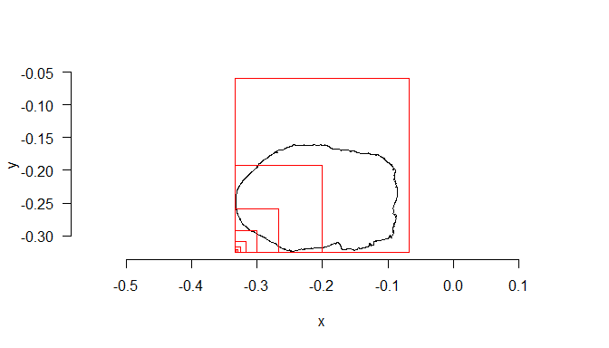

NSYSU_SfM_workshop
================
Yan
2025-05-03

# 簡介 / Introduction

本教學示範如何使用 `habtools` 套件計算三維網格 (3D mesh) 的複雜度指標。
This tutorial demonstrates how to compute complexity metrics for 3D
meshes using the `habtools` package.

Google Sheet
表單：<https://docs.google.com/spreadsheets/d/1bzkbs_vZW_oL9Juc1XiOjf3hgM3Hb-XQDLEPVxPApyg/edit?usp=sharing>
此表單用於記錄每位參與者所帶來最喜愛物品的 3D
模型之各項結構複雜度指標，我們將比較不同物體的數值，以探討各項複雜度指標的意義。This
spreadsheet records the complexity metrics of 3D models of each
participant’s favorite objects. We will compare values across different
objects to explore the meaning of each complexity metric.

## 前置作業與資料載入 / Setup and Data Loading

**中文說明**：載入必要的套件並從 `data/Goose_S1_cleaned.ply`
範例檔案載入網格資料。 **English Explanation**: Load the required
packages and import the example mesh from `data/Goose_S1_cleaned.ply`.

``` r
# 載入套件 / Load packages
library(habtools)
library(rgl)
library(Rvcg)

# 載入範例網格資料 / Load example mesh
# 請確保檔案在專案的 data 資料夾中
mesh <- vcgPlyRead("data/Goose_S1_cleaned.ply")
```

    ## Removed 3 duplicate 1 unreferenced vertices and 0 duplicate faces

## 檢查網格 / Checking the Mesh

在計算任何指標前，先視覺化網格並檢查 z 軸方向是否正確。 Before
calculating any metrics, visualize the mesh and ensure the z orientation
is correct.

``` r
# 繪製 3D 網格 / Plot 3D mesh
plot3d(mesh)

# 若XYZ軸數值太奇怪 可重新設置中心 / If XYZ values are too weird, reset the center
#mesh2 <- set_origin(mesh)
#plot3d(mesh2)
```

<figure>

<figcaption aria-hidden="true">Fig0</figcaption>
</figure>

## 解析度分佈 / Resolution Distribution

**為何需要此步驟？**
在處理三維網格資料時，各頂點之間的間距（解析度）往往不一致。如果不先確認和調整解析度分佈，後續的指標計算（例如分形維度和
Rugosity）可能會因解析度差異而產生偏差。此外，解析度分佈也有助於選擇適當的
voxelSize 參數以進行均勻重網格。 **Why this step?** Meshes often have
variable vertex spacing. Inspecting the distribution of distances
between adjacent vertices ensures that subsequent metric calculations
(e.g., fractal dimension and rugosity) are not biased by uneven
resolution. It also informs an appropriate choice of `voxelSize` for
uniform remeshing.

**中文說明**：計算網格中相鄰頂點間距並繪製直方圖以檢查解析度變異。
**English Explanation**: Compute distances between adjacent vertices in
the mesh and plot a histogram to inspect variation in resolution.

``` r
# 計算解析度向量 / Calculate vector of resolutions
resvec <- vcgMeshres(mesh)[[2]]

# 繪製直方圖 / Plot histogram of resolutions
hist(resvec, main = "Resolution Distribution", xlab = "Distance between vertices")
```

<!-- -->

``` r
# 顯示解析度摘要統計 / Display summary statistics of resolutions
summary(resvec)
```

    ##      Min.   1st Qu.    Median      Mean   3rd Qu.      Max. 
    ## 4.684e-06 1.187e-03 1.407e-03 1.528e-03 1.700e-03 8.666e-02

**何時需要均勻重網格？**
當解析度分佈非常寬（例如直方圖有長尾或多峰），表示網格上有極大或極小的頂點間距，這會影響後續的複雜度指標計算。此時建議進行均勻重網格，以獲得一致的解析度。相反地，如果直方圖大部分值集中在單一窄範圍，分佈均勻，則無需重新網格。
**When to remesh?** If the resolution histogram is very broad (e.g. long
tail or multimodal), indicating some vertex distances are much larger or
smaller than others, remeshing is recommended to achieve uniform
resolution. Conversely, if most values cluster tightly in a single
narrow range, the mesh is already uniform and no remeshing is needed.

``` r
# 均勻重網格 / Uniformly remesh mesh
mesh_uniform <- Rvcg::vcgUniformRemesh(mesh, silent = TRUE, multiSample = TRUE, voxelSize = median(resvec), mergeClost = TRUE)

Rvcg::vcgMeshres(mesh_uniform)[[1]]
```

    ## [1] 0.001420853

``` r
# 驗證重網格後解析度 / Check resolution of the remeshed object
new_res <- vcgMeshres(mesh_uniform)[[2]]
hist(new_res, main = "Resolution Distribution", xlab = "Distance between vertices")
```

<!-- -->

``` r
summary(new_res)
```

    ##      Min.   1st Qu.    Median      Mean   3rd Qu.      Max. 
    ## 0.0003464 0.0011435 0.0014429 0.0014209 0.0017290 0.0028366

## 視覺化驗證解析度分佈 / Visualize Resolution Distribution

``` r
# 將網格轉換為三維點雲 / Transform mesh to 3D point cloud
mesh_p <- mesh_to_points(mesh)
#plot3d(mesh_p)
mesh_pu <- mesh_to_points(mesh_uniform) 
#plot3d(mesh_pu)
```

<figure>

<figcaption aria-hidden="true">non-uniformed</figcaption>
</figure>

<figure>

<figcaption aria-hidden="true">uniformed</figcaption>
</figure>

## 體積與表面積 / Volume and Surface Area

**中文說明**：計算 mesh 的體積與總表面積。  
**English Explanation**: Compute the mesh’s volume and total surface
area.

``` r
# 計算 mesh 體積 / Compute mesh volume
# 需要 Rvcg 套件的 vcgVolume() 函式
mesh_volume  <- Rvcg::vcgVolume(mesh)

# 計算 mesh 表面積 / Compute mesh surface area
# habtools 提供 surface_area() 函式
mesh_surface <- surface_area(mesh)

# 將結果組成清單一併顯示 / Return both metrics
list(
  volume       = mesh_volume,
  surface_area = mesh_surface
)
```

    ## $volume
    ## [1] 0.002856333
    ## 
    ## $surface_area
    ## [1] 0.1404026

## 平面面積 / Planar Area

``` r
# 平面表面積 / Planar surface area
planar_area <- planar(mesh)
```

    ## L0 is set to mesh resolution (0.00152754054666314)

``` r
print(planar_area)
```

    ## [1] 0.03242759

## 複雜度指標：Rugosity (R), Fractal Dimension (D), Height Range (H)

### 分形維度 / Fractal Dimension

**中文說明**：使用 `cubes` 方法計算 mesh 的分形維度。 **English
Explanation**: Compute the fractal dimension of the mesh using the
`cubes` method.

``` r
# 分形維度計算 / Calculate fractal dimension
fd_result <- fd(
  mesh_uniform,
  method = "cubes",
  plot = TRUE,
  diagnose = TRUE
)
```

    ## lvec is set to c(0.002, 0.004, 0.008, 0.017, 0.033, 0.066, 0.133, 0.265).

<!-- --><!-- -->

``` r
# 提取 D 值 / Extract fractal dimension
fd_result$D
```

    ## [1] 2.135587

### 表面粗糙度及高度範圍 / Rugosity and Height Range

``` r
# 粗糙度計算 / Compute rugosity
rugosity_value <- rg(mesh_uniform)
```

    ## L0 is set to mesh resolution (0.00142085256201945)

``` r
print(rugosity_value)
```

    ## [1] 4.239207

``` r
# 計算高度範圍 / Compute height range
height_range <- hr(mesh_uniform)
print(height_range)
```

    ## [1] 0.2637615

## 形狀指標 / Shape Metrics

**指標定義與生態意義 / Definitions and Ecological Significance**

- **Convexity（凸度）**

  - **定義 / Definition**：mesh 表面積與其 convex hull
    表面積之比；值越接近 1 表示形狀越凸。
  - **生態意義 / Ecological
    Significance**：低凸度（更多凹陷）提供微棲位與附著點，增加物種豐富度與遮蔽；高凸度則在強流或侵蝕環境下更具結構穩定性。
  - **English**: Convexity is the ratio of the mesh surface area to the
    surface area of its convex hull; values close to 1 indicate a more
    convex shape. Low convexity reflects more indentations and niches,
    enhancing microhabitats and species diversity, while high convexity
    confers greater structural stability in high-flow or erosive
    conditions.

- **Packing（包裝度）**

  - **定義 / Definition**：mesh 體積與其 convex hull 體積之比；介於 0 到
    1，越高表示結構越密實。
  - **生態意義 / Ecological
    Significance**：高包裝度降低水流穿透與養分交換，但增加機械強度；低包裝度則有利於養分與光線滲透。
  - **English**: Packing is the ratio of the mesh volume to the volume
    of its convex hull, ranging from 0 to 1; higher values indicate a
    more compact structure. High packing density restricts fluid flow
    and nutrient exchange but enhances mechanical strength, while lower
    packing facilitates nutrient and light penetration.

- **Sphericity（球形度）**

  - **定義 / Definition**：Ψ = (π<sup>(1/3)\*(6V)</sup>(2/3)) / A，其中
    V 為體積，A 為表面積；完全球體時 Ψ=1。
  - **生態意義 / Ecological
    Significance**：高球形度降低表面積對體積比率，減少擴散損失；低球形度（如扁平或分枝形態）增大表面積，有利於光合作用與養分吸收，但在強流中易受損。
  - **English**: Sphericity measures how closely an object’s shape
    approaches that of a perfect sphere, calculated as Ψ =
    (π<sup>(1/3)\*(6V)</sup>(2/3)) / A. A value of 1 denotes a perfect
    sphere. Higher sphericity minimizes surface area relative to volume,
    reducing diffusive loss, whereas lower sphericity increases surface
    area beneficial for photosynthesis and nutrient uptake but may be
    more vulnerable in high-flow environments.

- **SMA（面積二階矩）**

  - **定義 / Definition**：SMA = ∬ r^2 dA，其中 r
    為表面元素到重心的距離。
  - **生態意義 / Ecological
    Significance**：反映結構對扭轉或剪切力的抗性；SMA
    越大表示表面質量分布更分散，影響流體動力穩定性。
  - **English**: Second Moment of Area (SMA) is defined as SMA = ∬ r^2
    dA, where r is the distance from surface elements to the centroid.
    It reflects resistance to torsional or shear forces; higher SMA
    indicates more distributed surface mass, affecting hydrodynamic
    stability.

- **SMV（體積二階矩）**

  - **定義 / Definition**：SMV = ∭ r^2 dV，其中 r
    為體積元素到重心的距離。
  - **生態意義 / Ecological
    Significance**：度量質量分布對整體穩定性的影響；SMV
    越大表示質量分布更分散，可能更能抵抗翻覆。
  - **English**: Second Moment of Volume (SMV) is defined as SMV = ∭ r^2
    dV, where r is the distance from volume elements to the centroid. It
    quantifies how mass distribution influences overall stability; a
    higher SMV indicates more dispersed mass distribution, potentially
    resisting overturning under dynamic forces.

- **CSF（機械形狀因子）**

  - **定義 /
    Definition**：結合表面積與曲率以度量對機械應力的敏感性，具體公式依實作而異。
  - **生態意義 / Ecological Significance**：高 CSF
    表示應力集中，易因撞擊或剪切而斷裂；低 CSF
    則能分散應力，更耐受機械擾動。
  - **English**: Mechanical Shape Factor (CSF) integrates surface area
    and curvature to uniformly measure sensitivity to mechanical stress;
    exact formula depends on implementation. Higher CSF indicates stress
    concentration and susceptibility to fracture, while lower CSF
    disperses stress, enhancing resistance to mechanical disturbances.

``` r
convexity_val <- convexity(mesh)
packing_val  <- packing(mesh)
sphericity_val <- sphericity(mesh)
sma_val <- sma(mesh)
smv_val <- smv(mesh)
csf_val <- csf(mesh)
```

    ## z_min set to -0.609558761119843

    ## resolution set to 0.00152754054666314

``` r
# 顯示結果 / Print results
list(
  convexity = convexity_val,
  packing = packing_val,
  sphericity = sphericity_val,
  second_moment_area = sma_val,
  second_moment_volume = smv_val,
  mechanical_shape_factor = csf_val
)
```

    ## $convexity
    ## [1] 0.7513123
    ## 
    ## $packing
    ## [1] 0.9912097
    ## 
    ## $sphericity
    ## [1] 0.6933963
    ## 
    ## $second_moment_area
    ## [1] 0.01319239
    ## 
    ## $second_moment_volume
    ## [1] 0.0001715002
    ## 
    ## $mechanical_shape_factor
    ## [1] 3235.181

## 轉換為 DEM 或 2D 形狀 / Transform mesh into a DEM or 2D shape

``` r
# 轉換為數字高程模型 / Convert mesh to DEM
dem <- mesh_to_dem(mesh_uniform, res = 0.002, fill = FALSE)
# 繪製 DEM / Plot DEM
raster::plot(dem)
```

<!-- -->

``` r
# 在 DEM 上計算 Rugosity (area 方法) / Compute rugosity on DEM
dem_rugosity <- rg(dem, method = "area")
```

    ## data contains 1842 NA values.

    ## L0 is set to the resolution of the raster: 0.002.

``` r
print(dem_rugosity)
```

    ## [1] 2.737936

``` r
# 轉換為 2D 點集 / Convert mesh to 2D points
pts <- mesh_to_2d(mesh_uniform)
plot(pts, asp = 1, main = "2D Projection of Mesh")
```

<!-- -->

``` r
# 周長計算 / Compute perimeter
perim_val <- perimeter(pts)
# 圓形度計算 / Compute circularity
circ_val <- circularity(pts)

# 2D 分形維度 (boxes 方法) / Compute fractal dimension in 2D
fd2d <- fd(pts, method = "boxes", keep_data = FALSE, plot = TRUE)
```

<!-- -->

``` r
# 顯示結果 / Print results
list(
  perimeter = perim_val,
  circularity = circ_val,
  fractal_dimension_2d = fd2d
)
```

    ## $perimeter
    ## [1] 0.8570739
    ## 
    ## $circularity
    ## [1] 0.7448982
    ## 
    ## $fractal_dimension_2d
    ## [1] 1.222986

## 參考文獻 / References

- Zawada KJA, Dornelas M, Madin JS (2019) Quantifying coral morphology.
  *Coral Reefs*, **38**:1281–1292.
- Madin JS & Connolly SR (2006) Ecological consequences of major
  hydrodynamic disturbances on coral reefs. *Nature*, **444**:477–480.
