NSYSU_dem_analysis
================
Yan
2025-05-07

# 簡介 / Introduction

本文件示範如何使用 R 語言與相關套件處理數值高程模型 (DEM)
與矢量資料，計算棲地複雜度指標。Welcome to a demonstration of R
workflows for processing Digital Elevation Models (DEM) and vector data
to compute habitat complexity metrics.

# 載入套件 / Load Libraries

以下套件將用於網格、向量處理與複雜度計算。

``` r
library(raster) # 網格資料處理 / raster data handling
```

    ## Loading required package: sp

``` r
library(sf)     # 空間向量資料處理 / vector spatial data
```

    ## Linking to GEOS 3.13.1, GDAL 3.10.2, PROJ 9.5.1; sf_use_s2() is TRUE

``` r
library(habtools) # 計算結構複雜度 / habitat complexity tools
```

    ## 
    ## Attaching package: 'habtools'

    ## The following object is masked from 'package:raster':
    ## 
    ##     extent

``` r
library(dplyr)   # 資料操作 / data manipulation
```

    ## 
    ## Attaching package: 'dplyr'

    ## The following objects are masked from 'package:raster':
    ## 
    ##     intersect, select, union

    ## The following objects are masked from 'package:stats':
    ## 
    ##     filter, lag

    ## The following objects are masked from 'package:base':
    ## 
    ##     intersect, setdiff, setequal, union

``` r
library(ggplot2)
```

# 載入 DEM / Load DEM

``` r
dem <- raster("./data/IL_P4_2205_DEM_5mm.tif") # 讀取數值高程模型 / read DEM file
plot(dem) # 繪製 DEM / plot the DEM
```

<!-- -->

# 載入正射影像 / Load Orthomosaic

``` r
# 1. 用 brick() 直接讀入多波段
ortho <- brick("./data/IL_P4_2205_5mm.tif")
```

    ## Warning: [minmax] min and max values not available for all layers. See
    ## 'setMinMax' or 'global'

``` r
# 2. 檢查物件類型，應該是 RasterBrick
ortho
```

    ## class      : RasterBrick 
    ## dimensions : 2401, 2793, 6705993, 4  (nrow, ncol, ncell, nlayers)
    ## resolution : 4.84056e-08, 4.5155e-08  (x, y)
    ## extent     : 120.7552, 120.7554, 21.95615, 21.95626  (xmin, xmax, ymin, ymax)
    ## crs        : +proj=longlat +datum=WGS84 +no_defs 
    ## source     : IL_P4_2205_5mm.tif 
    ## names      : IL_P4_2205_5mm_1, IL_P4_2205_5mm_2, IL_P4_2205_5mm_3, IL_P4_2205_5mm_4

``` r
# 3. 畫 RGB（如果它有超過 3 波段，請指定 r, g, b）
plotRGB(ortho, r = 1, g = 2, b = 3, scale = 255)
```

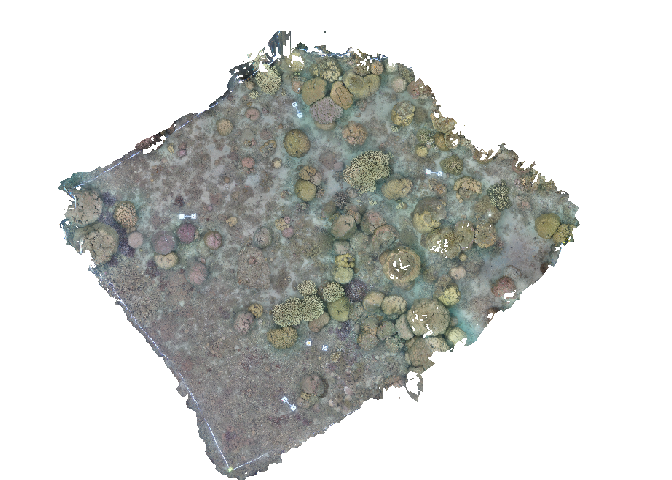<!-- -->

``` r
dev.off() # 重啟繪圖裝置避免互相影響
```

    ## null device 
    ##           1

# 尋找中心點 / Find Center Stake

``` r
lon <- 120.755303 # 樣框中心經度 / longitude of center frame
lat <- 21.956216  # 樣框中心緯度 / latitude of center frame
plot(dem)
points(lon, lat)
```

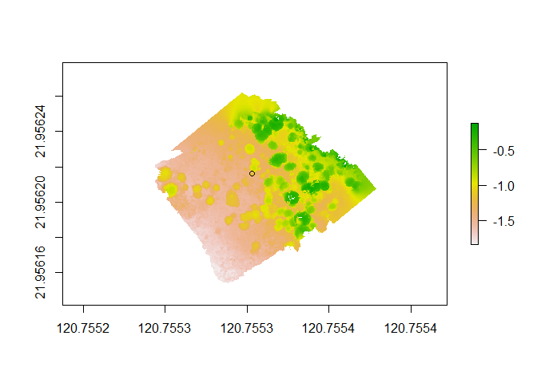<!-- -->

# 或是用內建函式找中心點 / Or using build-in funciton to find center stake

``` r
mid_find(dem)
```

    ##      x_mid    y_mid
    ## 1 120.7553 21.95621

# 重投影 DEM / Re-project DEM

``` r
sr <- paste0(
  "+proj=tmerc +lat_0=", lat,
  " +lon_0=", lon,
  " +k=1 +x_0=0 +y_0=0 +datum=WGS84 +units=m +no_defs"
)

dem2 <- projectRaster(dem, crs = sr) # 轉成以中心點為原點的投影座標
plot(dem2)
points(0, 0)
```

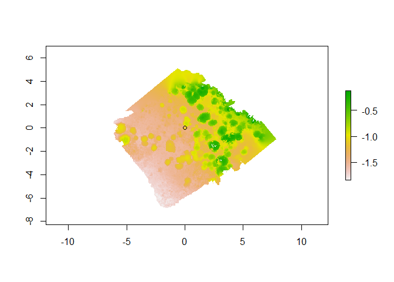<!-- -->

# 儲存重投影結果 / Save Re-projection

``` r
writeRaster(
  dem2,
  filename = "./output/IL_P4_2205_DEM-reproj.tif",
  overwrite = TRUE
)
dem2 <- raster("./output/IL_P4_2205_DEM-reproj.tif")
```

# 計算平均深度 / Calculate mean depth

``` r
z(dem2)
```

    ## [1] -1.168177

# 裁切 5×5 m 方塊 / Crop 5×5 m Square

``` r
dem_square <- crop(dem2, raster::extent(-2.5, 2.5, -2.5, 2.5))
plot(dem_square)
```

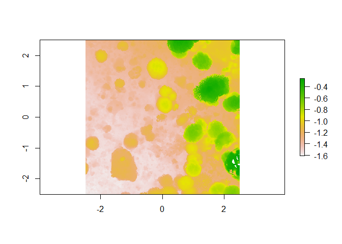<!-- -->

# 計算每平方公尺表面積 / Calculate Surface Area per square meter

``` r
surface_area(dem_square) / 25 # 除以平面面積 5×5, divide by planar area
```

    ## [1] 2.614636

# 範圍選取範例 / Example: dem_crop and dem_sample

``` r
dem3 <- dem_crop(dem_square, x0 = -1, y0 = 0.5, L = 2, plot = TRUE)
```

<!-- -->

``` r
# 或用 dem_sample 隨機取樣
# dem3 <- dem_sample(dem_square, L = 2, plot = TRUE)
```

# 計算 RDH 指標 / Compute RDH Metrics

``` r
hr(dem3) # 高程差異 / height range
```

    ## [1] 0.6493292

``` r
rg(dem3, method = "area", L0 = 0.01) # Rugosity 計算 / surface roughness
```

    ## [1] 1.741243

``` r
fd(dem3, method = "hvar", lvec = c(0.25, 0.5, 1, 2), plot = TRUE, diagnose = TRUE)
```

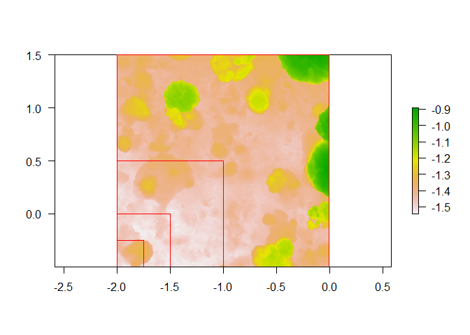<!-- -->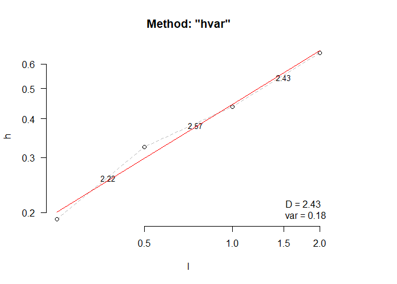<!-- -->

    ## $D
    ## [1] 2.425442
    ## 
    ## $data
    ##      l         h
    ## 1 0.25 0.1899245
    ## 2 0.50 0.3250653
    ## 3 1.00 0.4364259
    ## 4 2.00 0.6493292
    ## 
    ## $lvec
    ## [1] 0.25 0.50 1.00 2.00
    ## 
    ## $D_vec
    ## [1] 2.224696 2.574993 2.426787
    ## 
    ## $var
    ## [1] 0.1758379
    ## 
    ## $method
    ## [1] "hvar"

``` r
rdh(dem3, lvec = c(0.125, 0.25, 0.5, 1, 2), method_fd = "hvar", method_rg = "area")
```

    ## fd calculation using hvar method.

    ## rg calculation using area method.

    ## L0 is set to the resolution of the raster: 0.005.

    ##          R        D         H
    ## 1 1.859673 2.373662 0.6493292

# 四個 2×2 m 樣框 RDH / Four 2×2 m Quadrats RDH

``` r
exts <- list(
  NE = raster::extent( 0, 2,  0, 2),
  NW = raster::extent(-2, 0,  0, 2),
  SW = raster::extent(-2, 0, -2, 0),
  SE = raster::extent( 0, 2, -2, 0)
)
results <- lapply(names(exts), function(region) {
  sub_dem <- crop(dem_square, exts[[region]])
  R_val <- rg(sub_dem, method = "area")                # Rugosity
  D_val <- fd(sub_dem, method = "area", plot = FALSE)  # Fractal dimension
  H_val <- hr(sub_dem)                                   # Height range
  x0 <- (exts[[region]]@xmin + exts[[region]]@xmax)/2
  y0 <- (exts[[region]]@ymin + exts[[region]]@ymax)/2
  data.frame(region, R = R_val, D = D_val, H = H_val, x0, y0)
})
```

    ## L0 is set to the resolution of the raster: 0.005.

    ## lvec is set to c(0.016, 0.031, 0.062, 0.125, 0.25).

    ## L0 is set to the resolution of the raster: 0.005.

    ## lvec is set to c(0.016, 0.031, 0.062, 0.125, 0.25).

    ## L0 is set to the resolution of the raster: 0.005.

    ## lvec is set to c(0.016, 0.031, 0.062, 0.125, 0.25).

    ## L0 is set to the resolution of the raster: 0.005.

    ## lvec is set to c(0.016, 0.031, 0.062, 0.125, 0.25).

``` r
rdh_df <- do.call(rbind, results)

# 繪製並標註 / Plot and Annotate
plot(dem_square, axes = TRUE, box = TRUE, main = "DEM with 2×2 m Quadrats")
for(i in seq_len(nrow(rdh_df))) {
  e <- exts[[rdh_df$region[i]]]
  rect(e@xmin, e@ymin, e@xmax, e@ymax, border = "red", lwd = 2)
  txt <- sprintf("R=%.2f\nD=%.2f\nH=%.2f", rdh_df$R[i], rdh_df$D[i], rdh_df$H[i])
  text(rdh_df$x0[i], rdh_df$y0[i], labels = txt, cex = 0.8, col = "blue")
}
```

<!-- -->

# 匯入並顯示多邊形 / Import Polygons

``` r
shp <- st_read("data/IL_P4_2205_corals.shp")
```

    ## Reading layer `IL_P4_2205_corals' from data source 
    ##   `C:\Users\keelu\R\SfM_workshop\data\IL_P4_2205_corals.shp' 
    ##   using driver `ESRI Shapefile'
    ## Simple feature collection with 258 features and 9 fields
    ## Geometry type: MULTIPOLYGON
    ## Dimension:     XY
    ## Bounding box:  xmin: 224724.5 ymin: 2428727 xmax: 224729.1 ymax: 2428732
    ## Projected CRS: TWD97 / TM2 zone 121

``` r
crs_dem <- crs(dem2)
shp_proj <- st_transform(shp, crs = crs_dem)
plot(dem_square)
plot(st_geometry(shp_proj), add = TRUE, border = "red", lwd = 2)
centroids <- st_centroid(shp_proj)
```

    ## Warning: st_centroid assumes attributes are constant over geometries

``` r
coords <- st_coordinates(centroids)
text(x = coords[,1], y = coords[,2], labels = shp_proj$ID, cex = 0.8, col = "blue")
```

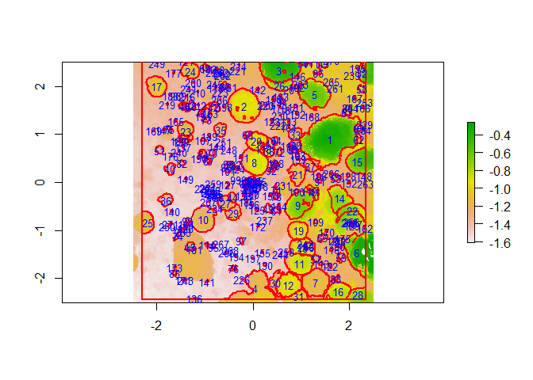<!-- -->

# 畫出族群結構 / plot population structure

``` r
# clean colony ID = 9999 which means non-coral substrate in my dataset
shp_proj$ID <- as.numeric(unlist(shp_proj$ID))
shp_clean <- shp_proj %>% filter(ID != 9999)

# 計算面積、周長與圓度 / Calculate area, perimeter and circularity
metrics <- shp_clean %>%
  mutate(
    area       = as.numeric(st_area(geometry)),  
    perimeter  = as.numeric(st_length(st_cast(geometry, "MULTILINESTRING"))),
    circularity  = 4 * pi * area / perimeter^2,         # circularity = 4πA / P²
    log_area   = log(area),                             # log 轉換尺寸
    logit_circularity = log(circularity / (1 - circularity))  # logit 轉換圓度
  )

N <- nrow(metrics) # calculate sample size

# 畫出族群尺寸組成（log 轉換後的 area）
ggplot(metrics, aes(x = log_area)) +
  geom_histogram(
    binwidth = diff(range(metrics$log_area, na.rm=TRUE)) / 30, 
    fill     = "steelblue", 
    color    = "white"
  ) +
  labs(
    x     = "Log(Area) (log m²)",
    y     = "Count",
    title = "Population Size Structure (log scale)"
  ) +
  annotate(
    "text",
    x     = Inf,       # 置於右上角
    y     = Inf,
    label = paste0("N = ", N),
    hjust = 1.1,       # 向左一點
    vjust = 1.1        # 向下一點
  ) +
  theme_minimal()
```

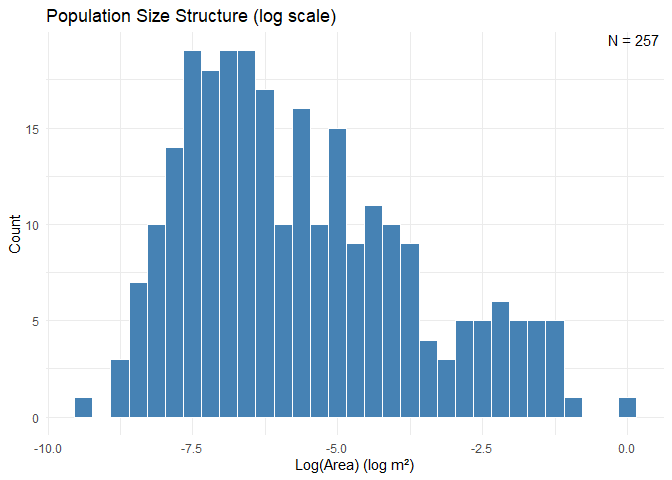<!-- -->

# 畫出型態組成 / plot morphological composition

``` r
# 計算平均值做為分隔點 calculate mean for mid point on x y
med_x <- mean(metrics$log_area, na.rm = TRUE)
med_y <- mean(metrics$logit_circularity, na.rm = TRUE)

# 計算四個象限的數量 calculate the amount in four quadrants
n_Q1 <- sum(metrics$log_area >  med_x & metrics$logit_circularity >  med_y, na.rm = TRUE)  # 右上
n_Q2 <- sum(metrics$log_area <= med_x & metrics$logit_circularity >  med_y, na.rm = TRUE)  # 左上
n_Q3 <- sum(metrics$log_area <= med_x & metrics$logit_circularity <= med_y, na.rm = TRUE)  # 左下
n_Q4 <- sum(metrics$log_area >  med_x & metrics$logit_circularity <= med_y, na.rm = TRUE)  # 右下

# 計算圖形範圍以便標註文字位置
x_min <- min(metrics$log_area, na.rm = TRUE)
x_max <- max(metrics$log_area, na.rm = TRUE)
y_min <- min(metrics$logit_circularity, na.rm = TRUE)
y_max <- max(metrics$logit_circularity, na.rm = TRUE)

# 構造標註資料框
labels_df <- data.frame(
  x = c((med_x + x_max)/2, (x_min + med_x)/2, (x_min + med_x)/2, (med_x + x_max)/2),
  y = c((med_y + y_max)/2, (med_y + y_max)/2, (y_min + med_y)/2, (y_min + med_y)/2),
  label = c(
    paste0("Q1: ", n_Q1),
    paste0("Q2: ", n_Q2),
    paste0("Q3: ", n_Q3),
    paste0("Q4: ", n_Q4)
  )
)

# 繪製散點圖、畫中位線、標註象限數量
ggplot(metrics, aes(x = log_area, y = logit_circularity)) +
  geom_point(alpha = 0.7) +
  geom_vline(xintercept = med_x, linetype = "dashed") +
  geom_hline(yintercept = med_y, linetype = "dashed") +
  geom_text(
    data = labels_df,
    aes(x = x, y = y, label = label),
    size = 4, fontface = "bold", color = "darkred"
  ) +
  labs(
    x = "Log(Area) (log m²)",
    y = "Logit(circularity)",
    title = "Morphological Composition with Mean Crosshairs and Quadrant Counts"
  ) +
  theme_minimal()
```

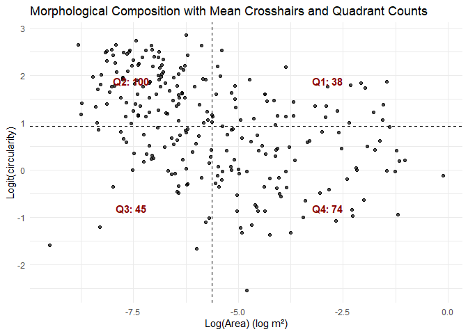<!-- -->

# 過濾、計算 2D 與 3D 面積 / Filter and Compute 2D vs 3D Areas

``` r
# filter the .shp files to faster the calculation speed
shp_proj$ID <- as.numeric(unlist(shp_proj$ID))
shp_clean <- shp_proj %>% filter(ID != 9999)
qs <- quantile(shp_clean$Shape_Area, probs = c(0.5, 0.75), na.rm = TRUE)
q2 <- qs[1]; q3 <- qs[2]
shp_sub <- shp_clean %>% filter(Shape_Area > q2 & Shape_Area < q3)
cat("共剩下", nrow(shp_sub), "個多邊形要處理\n")
```

    ## 共剩下 63 個多邊形要處理

``` r
results_list <- lapply(seq_len(nrow(shp_sub)), function(i) {
  poly_i <- shp_sub[i, ]
  dem_mask <- mask(dem2, poly_i)
  dem_clip <- crop(dem_mask, poly_i)
  if (all(is.na(values(dem_clip)))) return(NULL)
  area_2d <- as.numeric(st_area(poly_i))
  sa <- surface_area(dem_clip)
  data.frame(ID = poly_i$ID, area_2d_m2 = area_2d, surface_area_m2 = sa)
})
results_df <- bind_rows(results_list)

plot(log(results_df$area_2d_m2), log(results_df$surface_area_m2),
     xlab = "log (2D projected area (m²))", ylab = "log (3D surface area (m²))",
     main = "2D vs. 3D Surface Area", pch = 16)
abline(lm(log(surface_area_m2) ~ log(area_2d_m2), data = results_df), col = "red", lwd = 2)
corr <- cor(log(results_df$area_2d_m2), log(results_df$surface_area_m2))
legend("topleft", legend = paste0("Pearson r = ", round(corr, 3)), bty = "n", cex = 1.1)
```

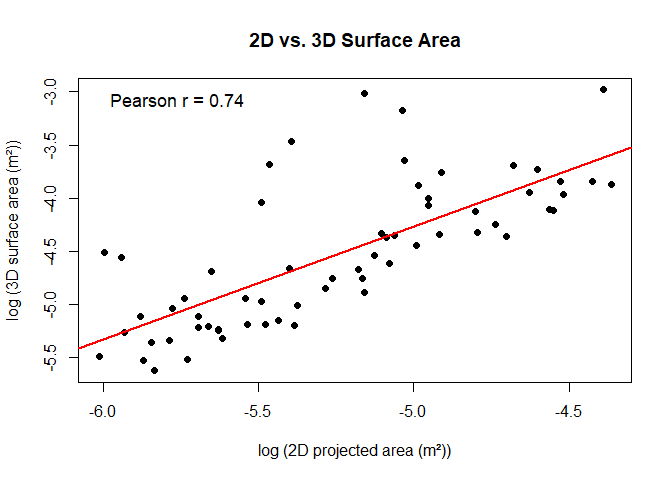<!-- -->

# 比較 T1 與 T+1 面積 / Compare T1 vs T+1 Areas

``` r
shp_t1 <- st_read("data/IL_P4_2205_corals.shp") %>%
  st_transform(crs = st_crs(.)) %>% mutate(ID = as.numeric(unlist(ID))) %>% filter(ID != 9999)
```

    ## Reading layer `IL_P4_2205_corals' from data source 
    ##   `C:\Users\keelu\R\SfM_workshop\data\IL_P4_2205_corals.shp' 
    ##   using driver `ESRI Shapefile'
    ## Simple feature collection with 258 features and 9 fields
    ## Geometry type: MULTIPOLYGON
    ## Dimension:     XY
    ## Bounding box:  xmin: 224724.5 ymin: 2428727 xmax: 224729.1 ymax: 2428732
    ## Projected CRS: TWD97 / TM2 zone 121

``` r
shp_t2 <- st_read("data/IL_P4_2312_corals.shp") %>%
  st_transform(crs = st_crs(shp_t1)) %>% mutate(ID = as.numeric(unlist(ID))) %>% filter(ID != 9999)
```

    ## Reading layer `IL_P4_2312_corals' from data source 
    ##   `C:\Users\keelu\R\SfM_workshop\data\IL_P4_2312_corals.shp' 
    ##   using driver `ESRI Shapefile'

    ## Warning in CPL_read_ogr(dsn, layer, query, as.character(options), quiet, : GDAL
    ## Message 1: organizePolygons() received an unexpected geometry.  Either a
    ## polygon with interior rings, or a polygon with less than 4 points, or a
    ## non-Polygon geometry.  Return arguments as a collection.

    ## Warning in CPL_read_ogr(dsn, layer, query, as.character(options), quiet, : GDAL
    ## Message 1: Geometry of polygon of fid 288 cannot be translated to Simple
    ## Geometry. All polygons will be contained in a multipolygon.

    ## Simple feature collection with 289 features and 6 fields
    ## Geometry type: MULTIPOLYGON
    ## Dimension:     XY
    ## Bounding box:  xmin: 13442420 ymin: 2506267 xmax: 13442420 ymax: 2506272
    ## Projected CRS: WGS 84 / Pseudo-Mercator

``` r
df1 <- shp_t1 %>% st_drop_geometry() %>% select(ID, Shape_Area) %>% rename(area_t1 = Shape_Area)
df2 <- shp_t2 %>% st_drop_geometry() %>% select(ID, Shape_Area) %>% rename(area_t2 = Shape_Area)
df <- inner_join(df1, df2, by = "ID")
cat("共有", nrow(df), "個相同 ID 同時存在於 T1 和 T+1\n")
```

    ## 共有 172 個相同 ID 同時存在於 T1 和 T+1

``` r
plot(log(df$area_t1), log(df$area_t2), xlab = "log(T1 Shape_Area (m²))",
     ylab = "log(T+1 Shape_Area (m²))", main = "Coral Polygon Area: T vs. T+1", pch = 16)
abline(a = 0, b = 1, col = "blue", lwd = 2, lty = 2)
mod <- lm(area_t2 ~ area_t1, data = df)
abline(mod, col = "red", lwd = 2)
```

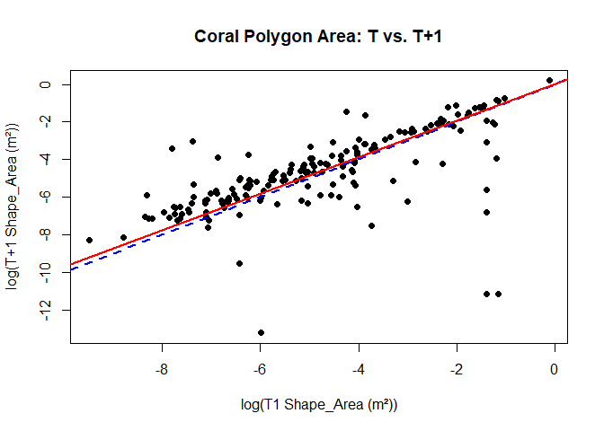<!-- -->

# 參考文獻 / References

- Torres-Pulliza, D. et al. *A geometric basis for surface habitat
  complexity and biodiversity.* Nat Ecol Evol 4, 1495–1501 (2020).
- Asbury, M. et al. *Geological age and environments shape reef habitat
  structure.* Global Ecol Biogeogr 32(7), 1230-1240 (2023).
- Chen, G. K. et al. *Relative contributions of size and shape to coral
  demography.* The American Naturalist, 205(6), 000-000 (2025).
